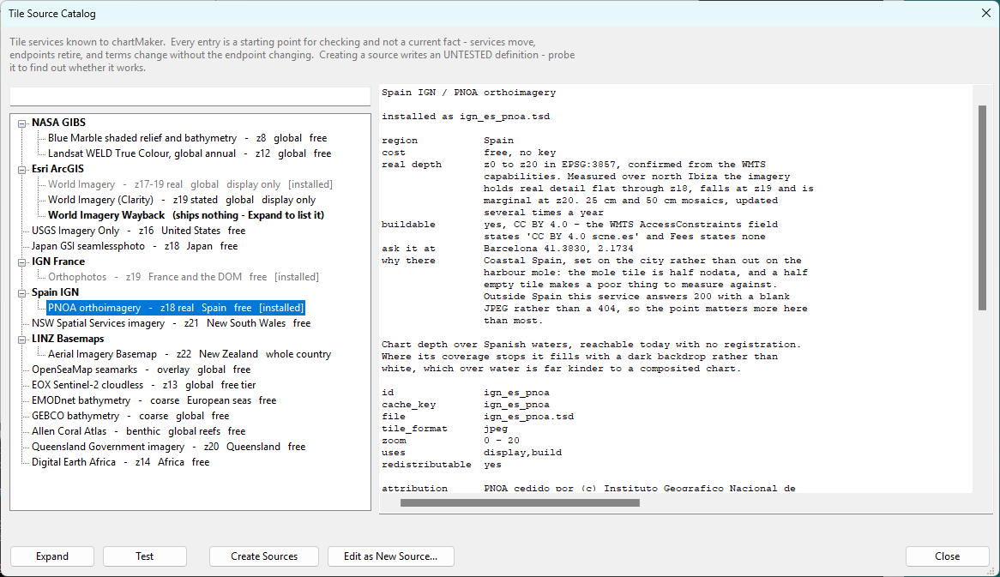

# The Catalog

**[Reference](readme.md)** --
**[Sources and TSD Files](sources_tsd.md)** --
**The Catalog** --
**[Preferences and Keys](preferences_keys.md)** --
**[Housekeeping](housekeeping.md)**

folders: **[Home](../readme.md)** --
**[Tutorial](../tutorial/readme.md)** --
**Reference**

A tile service is only useful to somebody who knows it exists. The **catalog** is the list of
services chartMaker ships knowing about, and the two ways of turning one of them into a
source you can use.

Open it with **`Edit - Tile Source Catalog`**, the **Catalog** button on the Sources pane, or
that pane's right-click menu. It reads one file that shipped inside the application, so it
opens instantly and works with no connection at all.

## Reading it

A tree of providers on the left with a filter above it, and what the selection says on the
right. The tree nests the way the world does - a provider over its layers - to whatever depth
each one needs.

For each entry the panel tells you what you need in order to **judge** it: roughly where it
covers, what it costs, how deep its imagery really goes, whether you may build from it, what
it requires, and one sentence on what it is worth to a mariner. A provider states its terms,
its licence, its attribution and its rate policy once; each layer under it carries its own
address and zoom range.

**An entry you already have installed is marked rather than hidden**, because on a second
visit most of the point is seeing what you have.

### Nothing in it claims to be current

Services move, endpoints retire, and terms change without the endpoint changing. **A row is a
starting point for checking, not a fact**, and the dialog says so in as many words.

It deliberately carries no dates. A date reads as a currency it has not got. The catalog ships
inside the installer, so the release already dates it more honestly than a hand-typed string
could.

**And an entry is untested by construction** - the catalog never goes near the network, so it
cannot know whether a url still answers. **Test** is what finds that out.

### Where a service is asked

Every service names one **canonical point**: somewhere it is known to hold imagery, with the
reason it was chosen. Every question worth asking a tile service is placed - *is this address
right, how deep does it go, is that a tile or a blank* - and an answer is only as good as the
place. Region prose does not predict where the tiles are and neither does a bounding box: one
service labelled "Japan" serves real imagery over Panama at some levels and nothing at
others, and another labelled "Spain" answers outside Spain with a blank picture rather than a
refusal.

## Expand: what a service publishes today

Some providers publish their own list of layers, and where they do, the group offers
**Expand**. chartMaker fetches that list and fills the group in from it.

This is the difference between what changes on the scale of years - the provider, its terms,
its licence - and what changes on the scale of months, which is what it actually holds. The
first ships; the second is asked for.

Three things to expect:

- **It can be slow.** One provider's document is over five megabytes of XML. It runs behind a
  progress dialog and can be cancelled - though cancelling abandons the answer rather than
  stopping the request, because nothing can interrupt a fetch in flight.
- **You will get a great many layers.** One service publishes over a thousand readable ones,
  and most are science products - aerosol depth, soil moisture, rain rate - perfectly
  addressable and of no use whatever under a boat. **The list is ordered deepest first**,
  where a chart author looks, and layers a service publishes only as PNG are folded into one
  group beneath it, because a provider serving both photographs and data products serves them
  in different formats. Nothing is filtered out: which layer is useful is your judgement, on
  the one screen you are looking at in order to make it.
- **Nothing fetched is written down.** Expanded layers live for as long as the dialog does.
  Keeping them would be a cached list that looks exactly like a current one.

## Test

**Test asks the service whether an entry is true, without creating anything.** Judging twenty
candidates by writing twenty files and testing each is the long way round to a decision you
can make first, and it leaves twenty files behind.

It uses the entry's canonical point and the same verifier the source editor uses, on exactly
what **Create** would write - so what is tested is what you would get. The dialog names each
field the answer refutes and says where it is fixed.

It takes one entry at a time, because its answer is a column of levels at a place and there is
no way to read twenty of those at once.

## Getting one out: Create, or Edit

**Create writes files.** Every instrument chartMaker has works on a `.tsd` file - the map
shows one, Test and the probe measure one, the Sources pane lists them - so writing the file
is the on-ramp to all of it. You can select several entries and create them together, which is
how you get twenty candidates onto the bench.

Create resolves collisions up front and shows you the whole outcome before taking one answer:

| | |
| --- | --- |
| the **id** is already installed | skipped, naming the file that has it - you almost certainly already have this one |
| the **cache_key** is held against a **different** service | skipped - renaming it would quietly start a second copy of a cache that may hold gigabytes |
| the **file name** is taken | renamed, and the rename is stated - nothing points at a file name |

**What is skipped is shown as prominently as what is written**, so a list of results never
reads as though the rest happened too.

**Edit opens one entry in the source editor** without writing anything, as a file that does
not exist yet. That is the exit for the entry you have already decided about, and where a
value only you can supply gets typed.

## Keyed entries

An entry needing an API key creates a perfectly good file, with the key's **name** declared
and no value in it. The panel names each key, says whether anything is bound to it, and gives
you the address to go and get one.

**Create and Test may prompt you for a missing key**, because you are sitting there and have
just clicked something. Declining is an answer - it does not ask again and does not proceed
anyway. Build and probe never prompt: they report and stop, because a dialog appearing in the
middle of a two hour run ambushes somebody who walked away from it.

**Expand needs a key before any file exists**, since a keyed service's capabilities document
is keyed too - which is exactly why the key store is a free-standing list rather than
something hanging off an installed source. And when such a service hands back templates with
your live key baked into them, chartMaker strips it back out to `{key_name}` before anything
is written down.

---

**Next:** [Preferences and Keys](preferences_keys.md)
