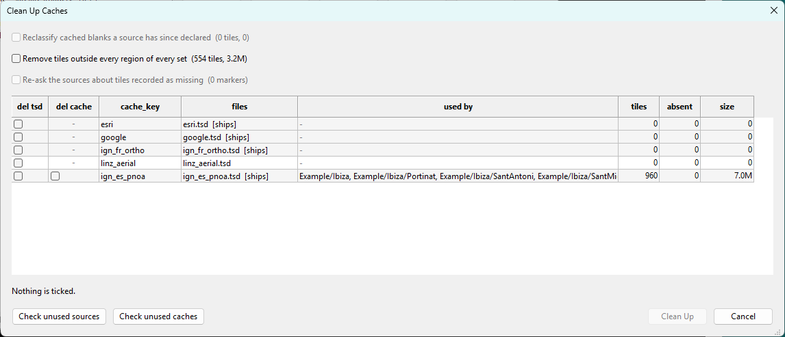

# Housekeeping

**[Reference](readme.md)** --
**[Sources and TSD Files](sources_tsd.md)** --
**[The Catalog](catalog.md)** --
**[Preferences and Keys](preferences_keys.md)** --
**Housekeeping**

folders: **[Home](../readme.md)** --
**[Tutorial](../tutorial/readme.md)** --
**Reference**

Two things accumulate that nothing removes on its own. Browsing around to find a region fills
the tile cache with tiles no build will ever read, and trying out services leaves a `.tsd`
behind whether or not the service was any good. Neither is a fault, and both are invisible - a
cache is a folder of numbers, and forty source definitions look the same whether one region
uses them or none does.

## The cache is not temporary

Fetched tiles go in your `cache` folder, and it is deliberately not a temp directory. *Temp*
is a promise that anything may delete it, and these tiles are bandwidth, wall clock, and for
some services requests that should not be repeated. **Reconstructible is not the same as
disposable.**

Tiles are filed **per source**, one folder each, so you can look at the cache in Explorer and
see what you have used. That separation is not a nicety: the same tile coordinate means a
different picture in every service, and a cache without it would answer one source's request
with another source's imagery, producing a build that looks complete and is wrong.

**Misses are cached too.** A tile a service told us it does not have is recorded as absent, so
it is never asked for again and the edge of a service's real coverage accumulates for free as
you work. That is why a source never has to declare where its imagery is.

**Nothing expires on its own.** There is no setting that trims the cache when you quit or
removes a source you stopped using, because both would act on a region you draw tomorrow, and
for some services a re-request is not free. Cleaning up is something you ask for while looking
at what it would do.

## Clean Up Caches

**`File - Clean Up Caches`**.

<a href="../images/cleanup.png" target="_blank"></a>

It surveys first and then offers. One row per cache, and a row carries the `.tsd` files that
address it - which may be several, and may be none:

- two tick columns, **del tsd** and **del cache**
- the **files** addressing it, and whether they ship with chartMaker
- **used by**, naming the regions
- **tiles**, **absent**, and **size**

A row with **no files** is an orphan cache - what renaming a source's `cache_key` leaves
behind. A row with **files and no tiles** is a source that has never fetched anything.

### What counts as in use

Four things, and the second is the one that makes this worth showing:

- a region in **any** set names it - including sets you do not have open, which nothing else
  in the application can see
- it is the **default source**, so it is drawing your map right now
- it **ships with chartMaker**, so a fresh installation has it

A detail area that inherits counts against the source it inherits, so it keeps its parent's
tiles alive.

That last one does not protect a file - it keeps it out of "check all unused", which would
otherwise empty a fresh installation in one click, since nothing is used until a region names
it.

### The three sweeps

These apply across every row rather than to one, so they sit above the list with the counts
the survey found.

**Reclassify cached blanks.** Some services answer a request for ground they do not hold with
a picture saying so rather than a refusal. Once that picture has been fingerprinted in the
`.tsd`, new fetches record it correctly - but tiles cached *before* that are still sitting
there as imagery. This converts them into nine-byte absence markers, which frees the space and
keeps what was learned. It is not a delete: deleting would make the tile unknown again and the
next pass would spend a request re-learning what is already known.

**Trim tiles outside every region.** The rendering cache going away, which is what it is for -
a browse is cheap to make again. Images only; the absence markers are not imagery, each one
cost a request to learn, and removing them would spend bandwidth to free nothing.

A trim over a cache that **no region anywhere uses** is refused rather than performed, because
every tile in it is outside every region and the sweep would silently empty the folder under a
name that does not say so. Deleting that cache outright is a legitimate thing to want, and it
is the column beside it.

**Re-ask about tiles recorded as missing.** The only thing in this dialog that touches the
network.

An absence is permanent and nothing expires it, which is right almost always and wrong in one
case: a service that refused once when it should not have. A blink, a deployment, or load shed
under the burst of requests a pan generates all arrive as a refusal, and a refusal is written
down as a fact. Nothing asks again, so the hole is in every chartset built from that ground
afterwards. Measured against one service: **3 of 64 recorded absences were false**, all three
scattered singles rather than a block - which is the shape of a service blinking rather than
of a real edge.

It **re-asks rather than forgets**. Deleting the markers would fix the same three and throw
away the sixty-one that were true, each of which cost a request to learn. The count is shown
before the question, because it is one request per marker and two on any still missing, and
the report says which way each went - cleared, confirmed, or unreachable.

Suspecting one particular service is the common case, and surveying every cache to chase it is
the wrong shape - so **right-clicking that source in the Sources pane** runs the same sweep
scoped to it.

### The two deletions

They are independent on purpose.

Deleting a **cache** is only ever a cost decision - the tiles come back if you want them
again, so it needs no guard beyond the count and the size.

Deleting a **definition** is the one act here that loses something fetching cannot recover: a
few kilobytes of text, often with a survey behind it. That is why it is the column carrying
"used by", and the column that starts unticked.

## Your own material

Everything you authored or acquired is under one folder:

```
    Documents\phorton1\chartMaker\
```

**Back that up and you have backed up everything** - your regions, your sources and your keys.
Uninstalling chartMaker does not touch it, so an upgrade is an install over the top.

- **A region set is a folder**, and the files in it are the set. Zip one and mail it. Drop a
  region somebody sent you into the folder and it is in the set - there is nothing to
  register.
- **A region file is self-contained.** It refers to nothing outside itself, so sharing one
  never ships your endpoint, your key, or a path on your disk.
- **Explorer is the set editor.** Renaming, copying and deleting a set are things Windows
  already does well, and chartMaker does not duplicate them. The Regions pane's right-click
  offers **Open folder in Explorer** to make the trip short.

**Built output is not your material** - it is a build artifact, regenerable from the model at
any time. That is the whole point of keeping a coverage model rather than a pile of tiles: a
card is something you make again, not something you look after.

## Getting the shipped material back

**`Help - Restore Shipped Sources and Examples`** puts back the source definitions and the
example region set that come with chartMaker.

It surveys before it does anything and shows you three states: **not there** (ticked),
**identical** (nothing to do), and **CHANGED** - a file you have edited, which is listed but
**not** ticked, and which it will not replace unless you say so and confirm.

**It never removes anything, and a file you created is not in the list at all.** A region you
drew lives happily in the same folder as a shipped one, and regenerating leaves it exactly
where it is.

---

**Next:** [Home](../readme.md)
