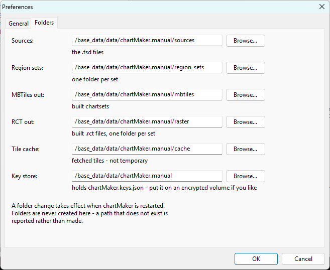
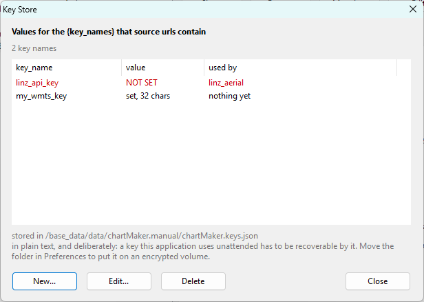

# Preferences and Keys

**[Reference](readme.md)** --
**[Sources and TSD Files](sources_tsd.md)** --
**[The Catalog](catalog.md)** --
**Preferences and Keys** --
**[Housekeeping](housekeeping.md)**

folders: **[Home](../readme.md)** --
**[Tutorial](../tutorial/readme.md)** --
**Reference**

**`View - Preferences`** opens two pages: **General** and **Folders**.

Nothing in preferences is part of a region set. Move a folder, change a rate, and every set
you own behaves the same way afterwards.

## Folders

Six locations, each with a Browse button, each defaulting under your Documents folder:

| | |
| --- | --- |
| **Sources** | the `.tsd` files |
| **Region sets** | one folder per set |
| **MBTiles out** | built chartsets |
| **RCT out** | built `.rct` files, one folder per set |
| **Tile cache** | fetched tiles - *not* temporary, see [Housekeeping](housekeeping.md) |
| **Key store** | holds `chartMaker.keys.json` |

The obvious reason to move one is size. A tile cache is the thing that grows without bound
and it is a natural candidate for a bigger or cheaper drive.

**A folder you nominate must already exist.** chartMaker reports a missing one rather than
creating it, because a path that is not there is far more likely to be a typo, an unmounted
drive, or a preferences file copied from another machine than an instruction to build a tree
somewhere unexpected - and building it would look like success while hiding the real problem.
Use the folder browser's own *Make New Folder* if you want a new one.

## General

**Map browser** - which browser the map opens in; empty means your system default.

**Server port** - chartMaker runs a small web server on your own machine, purely so the map
can talk to it. Nothing outside your computer is listening. Change this only if something
else is already using the port - chartMaker will tell you if that happened, and everything
except the map keeps working.

**Map maximum zoom** - how far in the map lets you go.

### What a new region starts with

**Authored level**, **Overview floor** and **Deepest level** - the `zauthor`, `zmin` and
`zmax` a newly created region is offered. They ship as **15 / 10 / 16**, which is a good
answer for coastal work. If you are consistently working somewhere else, change them here
rather than retyping them.

### JPEG quality

What `.rct` files are encoded at, since that format carries JPEG only. Higher is bigger.

### How gently to treat somebody else's server

| | |
| --- | --- |
| **Requests at once** | how many fetches are in flight at any moment. **Changing it needs a restart.** |
| **Slowest interval** | a floor under the gap between requests, for every source. |

There is one rule here and it is worth stating plainly: **every knob at every level can only
ever make chartMaker gentler.** A source's own declared limits, this installation's settings,
a per-set advisory in the build configuration, and any backoff a server asked for are
combined by taking the slowest and the fewest. **No combination of settings anywhere goes
faster than a source declared.**

A "finish by" budget in the build configuration works the same way - it is computed into an
interval, so it can only ever slow a run down. A run that has not finished by six in the
morning is a run with fewer tiles, not a run that sped up to make the time.

### Probe defaults

**Samples per level**, and the **from** and **to** levels a
[probe](../tutorial/choosing_a_source.md) dialog opens on. More samples means more requests
but not faster ones, so this one is independent of the rate knobs above.

## The key store

**`File - Key Store`**.

A `.tsd` declares the **names** of the values its url needs and never the values themselves.
This is where the values live: a plain list of name to value, and nothing else.

The dialog shows what is bound, what each name is used by, and lets you add, change or clear
one. **New...** invents a name before any file mentions it, which is a normal order of work -
you are about to write a source by hand, or you need the value in order to ask a service what
it publishes.

**It never shows you a value it did not just receive.** The list says *set* or *not set* and
how long it is. Somebody looking over your shoulder is not somebody who should be reading your
key, and a value you genuinely want back is in the file.

**A name nothing uses is not an error** - inventing a key before writing the source that
needs it is ordinary. What the dialog does flag is the state that is always wrong: a source
declaring a name with nothing bound to it.

### It is plain text, and the answer is the folder

**A key chartMaker uses unattended has to be recoverable by chartMaker**, so encrypting it
under another key kept beside it would be theatre. The file is plain JSON and the dialog says
so.

The real control is **where it lives**, which is why the key store has a folder preference of
its own. By default it sits with the rest of your material, where it will not be lost - but
that folder is backed up and often cloud-synced. If you would rather your keys were not
copied to a sync service, point the key store at removable media or an encrypted volume and
leave everything else where it is.

### Where you are asked for one, and where you are not

**The catalog and Test may prompt you**, because you are sitting there and have just clicked
something. **Build, the probe and the map never do** - they report and stop. A build runs for
hours behind a progress dialog, and a prompt there ambushes somebody who walked away; a pan
across the map should not raise a dialog either. A build meets the question at its preflight
instead, which is the last moment it can be asked cheaply.

If a url cannot be completely filled in, **no request is made at all**. A half-substituted
address is a malformed question to put to somebody else's server, and it is recorded as an
error about your configuration rather than as an absence in the imagery - so nothing permanent
is written over ground you happened to look at before pasting your key in.

Anything chartMaker prints - a log line, an error a server sent back, a build report - has
every value in your store taken back out of it and the name put in its place first.

---

**Next:** [Housekeeping](housekeeping.md)
