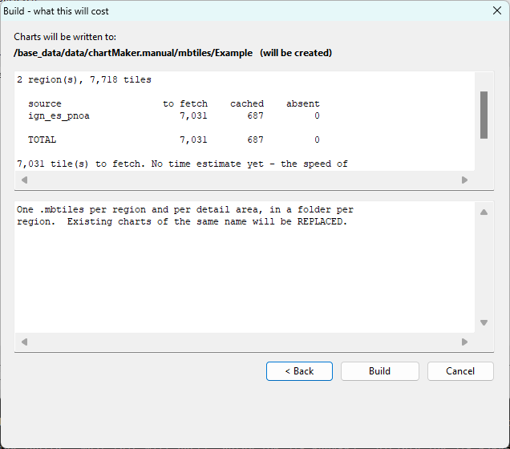
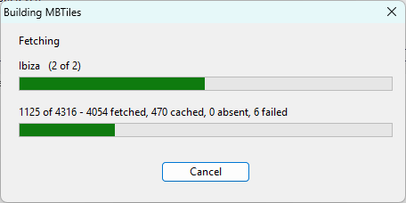

# Building

**[Tutorial](readme.md)** --
**[Getting Started](getting_started.md)** --
**[The Map](the_map.md)** --
**[Zoom Levels](zoom_levels.md)** --
**[Your First Region](regions.md)** --
**[Detail Areas](detail_areas.md)** --
**[Choosing a Source](choosing_a_source.md)** --
**Building**

folders: **[Home](../readme.md)** --
**Tutorial** --
**[Reference](../reference/readme.md)**

Everything so far has been a description. This chapter turns it into files.

Before you start, two things.

**Every region you are about to build needs a source.** If you have not set one on Formentera,
do it now - [Your First Region](regions.md#tell-it-where-the-pixels-come-from) - or read on and
meet the refusal, which is also a perfectly good way to learn what it looks like.

**This is the point at which chartMaker makes thousands of requests to somebody else's server
on your behalf.** Which service, and on what terms, is your decision - made when you set the
region's source, and answerable by you. The two sources that ship having `build` in them are
national orthophoto programmes published under open licences that permit exactly this, with
attribution. If you have pointed a region at something else, this is the moment to have read
its terms.

## The Build menu

```
    Fetch Tiles
    ---
    Build RCT
    Build MBTiles
```

**Fetch Tiles** fills the tile cache and writes no output. **Build RCT** and **Build
MBTiles** fetch what they need and then write files.

So Fetch is never *required* - but it is the half that takes the hour, and separating it lets
you fill a region overnight and build in a minute the next morning. It is also completely
safe to interrupt: chartMaker asks the cache before the network, so a run that stopped
half-way resumes by simply being run again, and nothing has to remember where it got to.

**Everything is cached by source**, and displaying and building share that one cache. The
tiles you looked at while drawing Formentera are already there and will not be fetched twice.

## Nothing starts without a preflight

Both Fetch and Build go through two dialogs, and **every question you could be asked is asked
before the first request goes out.** A confirmation at the end of a three hour run is one
nobody is sitting there to answer.

### One - what, and for an RCT, where

A checkbox list of the regions in your set. Tick **Ibiza** and **Formentera**.

This is the **build configuration** and it persists, in the set's own folder. It is not
hidden state - it means "what am I working on" stops being re-decided every single time, and
for the ordinary case of working on one region, Build just runs.

**A region that cannot be built says so on its own line and cannot be ticked.** If you never
set Formentera's source, this is where you find out:

```
    Ibiza
    Forment      -- no source chosen
```

Click it anyway and chartMaker tells you what to do about it. **None of that is remembered** -
set the source, come back, and the row is an ordinary row again. Ticking everything that
*can* be built still counts as "the whole set", so a region you fix later, or add next month,
is built along with the rest without you having to come back here.

**Build RCT adds an output folder to this dialog and nothing else does**, which is why its
title says *what and where* where the other two say *what*. An `.rct` chartset is a folder
you copy onto a card, so where it goes is a decision worth being asked; a fetch writes no
output at all, and MBTiles has a single destination with nothing to choose - the preflight
names it.

That folder defaults sensibly and can be changed, which is what makes a trial build possible
- somewhere other than the one you copy from. A folder you nominate must already exist;
chartMaker creates only the folders it chose the location of, because a path that is not
there is far more likely to be a typo or an unplugged drive than an instruction.

### Two - what it will cost

**Press `Next >`.** The second dialog appears, and this one is the whole reason the chain
exists:

<a href="../images/preflight.png" target="_blank"></a>

This is where you decide. **The picture is the MBTiles one**, which is the simpler of the
two - it is worth meeting first, and the .rct version adds rows rather than changing any.

Reading down it:

- **where the output goes**, in bold, saying so if the folder is about to be created
- **tiles to fetch**, **already cached** and **recorded absences**, one line per source and
  then a total. Two regions and 7,718 tiles here, of which 687 are already in the cache from
  looking at them
- the **estimated time** - and if chartMaker has never yet measured how fast this service
  answers *for you*, it shows the count and offers no time at all, because an estimate wrong
  by a factor of three is worse than none. That is what has happened in the picture
- a **note panel**, which is empty of alarm here and simply says what the output will be

**A `.rct` build adds three more things to that note panel**, because they are all questions
about one fused E-Series pyramid and an MBTiles build has no such thing:

- the **size** the file will come out at
- **which `.rct` files will be replaced**, and which files are already in that folder and are
  *not* part of this build
- whether your regions **disagree with each other** about `zauthor` or `zmin`

Then **Build**, **Back**, or **Cancel**. Back keeps your selection - you still meant to build
those regions, you just did not like the price.

**A recorded absence is information, not a warning.** It is the normal edge of a service's
coverage; retrying will never change it.

### When a set is not ready

If anything you selected cannot say what imagery it is made of, this dialog says so instead of
pricing the job, and **Build is switched off**:

```
    THIS CANNOT BE BUILT AS IT STANDS:
    no build source has been chosen for:
        Forment
      set one in the Regions pane - its source list offers every
      installed source that can build
```

It names the **regions**, grouped by what is wrong with each, with the remedy under each
group. There are four things it can say - nothing chosen, a source that is not installed, a
source that is for display only, and a source needing a key you have not entered - and they
are four different problems with four different fixes, so it never lumps them together.

A detail area that inherits is not listed. It said *whatever my region says*, which was a
perfectly good answer to a question its region got wrong, and the region is the row to go and
change.

**Press Back, fix it, and come straight back** - the region list is one dialog away, which is
why Back is the button with the focus.

**This is why Fetch and Build are not greyed out** when a set is not ready. A greyed menu item
cannot tell you *which region*, and which region is the entire answer, so the command runs far
enough to say it.

## While it runs

**Press `Build`.** The dialogs close and this appears:

<a href="../images/progress.png" target="_blank"></a>

**Two bars**, because the wait has two shapes. The outer counts regions - a number you chose
and can predict. The inner counts tiles within one region, which is thousands, and is where
the hour actually goes.

**Cancel is safe.** It sets a flag, the current tile finishes, and everything unwinds. Errors
are never cached, so nothing is poisoned by stopping - run it again and it resumes.

## What it refuses, and what that costs

Two things stop a build, and both make sense once:

**Unsaved edits.** A file built from what is on your screen while the disk says something
else is a discrepancy you would discover on the water, hours later, where you cannot explain
it. Save, or Revert.

**A fetch does not ask this, and that is on purpose.** A fetch writes no chart, so nothing it
produces claims to have come from a set on disk - it fills the cache, and filling it for a
polygon you are still adjusting is the normal way to work. Only the thing that writes a file
has a promise to keep. The preflight says which of the two you are in rather than leaving you
to discover it by trying the other one.

**Tiles that never arrived.** Not tiles the service *told* us it does not have - those are
fine and are the normal edge of coverage - but tiles that were asked for and failed. In the
finished file those two are indistinguishable: both make the plotter magnify a coarser tile,
and both look soft rather than broken. Only the build can still tell them apart, so it does.

Both refusals have an explicit override if you disagree.

**A refusal costs nothing.** Every file is written under a temporary name and renamed only on
success, so a cancel, a crash or a full disk cannot leave you a fragment that looks complete.
A refused or cancelled build leaves the folder exactly as it found it.

## The two outputs

`Build RCT` and `Build MBTiles` are the same act with a different writer, and **the second is
nearly free once the first has fetched** - the tiles are already in the cache, so nothing goes
to the network at all.

### `.mbtiles`, for OpenCPN

A standard, widely-read container. You get **one file per node** - one for Ibiza, one for each
of its detail areas, one for Formentera, one for Espalmador - because the format carries a
single maximum zoom for a whole file, and a reader works out the chart's scale from it. Point
OpenCPN's chart directory at the folder and it will find them.

### `.RCT`, for a Raymarine E-Series

One `.RCT` file per region, written into a folder that goes onto a CF card as `\RASTER\`.
There is no manifest: **the files present are the chartset**, which is why copying the folder
is a copy rather than a decision.

This is what the aerial photo overlay in the custom E-Series firmware reads - the firmware
[navMate](https://github.com/phorton1/base-apps-navMate/blob/master/user_manual/readme.md)
builds. The plotter fuses every `.RCT` on the card into one pyramid, which is why every region
on one card must agree on `zauthor` and `zmin`, and why the preflight checks it - including
against files already sitting in that folder from an earlier build.

If either format's details matter to you, they have their own specifications:
[MBTiles](../../docs/design/mbtiles.md) and [RCT](../../docs/design/rct.md).

## The report

A build ends **built**, **refused** or **cancelled**, and the report says which before it says
anything else - because the detail of a success and the detail of a refusal look alike at a
glance and only one of them wrote a file.

## And then

You have a chartset of the Pityusic islands built from open Spanish orthoimagery: two coastal
bands of Ibiza with the posidonia bays at z18, and a Formentera you drew yourself with
Espalmador inside it.

The model is the thing to keep. Come back next winter, add Menorca, deepen the anchorage you
found this summer, and rebuild - the tiles you already have cost nothing the second time.

For everything else - writing your own sources, the catalog of services chartMaker knows
about, moving your folders, and clearing out a cache that has grown - see the
**[Reference](../reference/readme.md)**.

---

**Next:** [Reference](../reference/readme.md)
