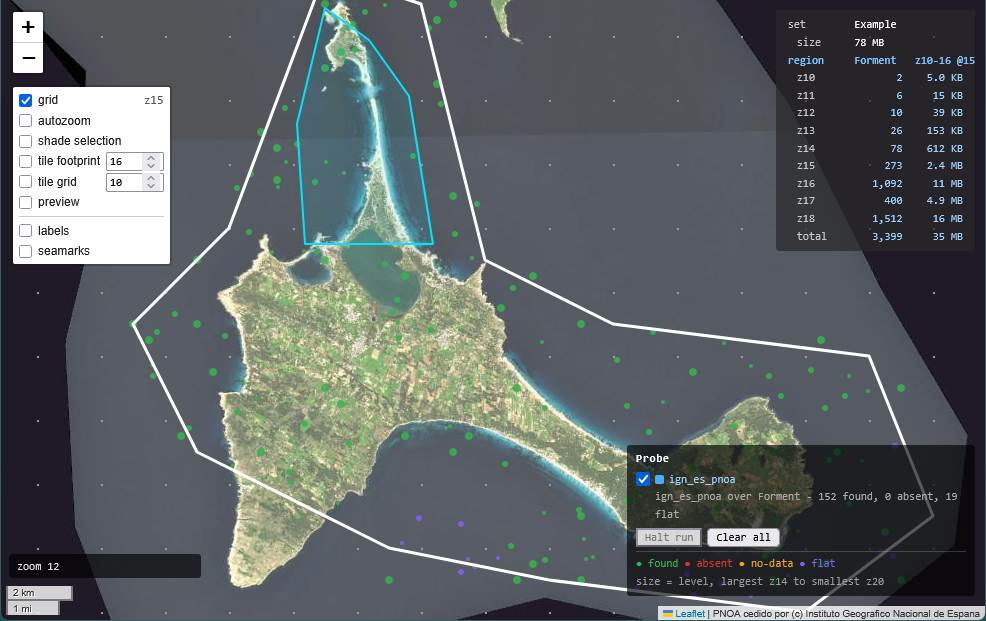
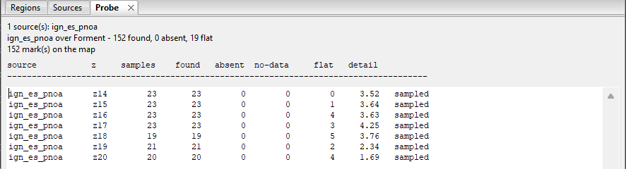
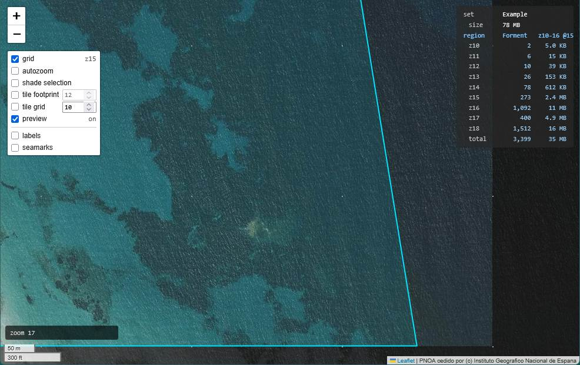

# Choosing a Source

**[Tutorial](readme.md)** --
**[Getting Started](getting_started.md)** --
**[The Map](the_map.md)** --
**[Your First Region](regions.md)** --
**[Detail Areas](detail_areas.md)** --
**Choosing a Source** --
**[Building](building.md)**

folders: **[Home](../readme.md)** --
**Tutorial** --
**[Reference](../reference/readme.md)**

You have said where your chartset goes and how deep. This chapter is about the other half:
**where the pictures come from, and how deep they are actually any good.** Those are not the
same question, and guessing at the second is how people spend three hours fetching magnified
blur.

## A source is a definition, not imagery

chartMaker ships **no tiles**. What it ships is a handful of small text files called **TSD**s
- *Tile Source Definitions* - each describing one imagery service: where its tiles live, how
deep it will answer, who must be credited, and what its publisher permits. You can write your
own, be given one, or make one from the built-in [catalog](../reference/catalog.md). See
[Sources and TSD Files](../reference/sources_tsd.md) when you want to.

### Display, and build

Every source declares what it may be used for. **Display** means you may look at it.
**Display and build** means you may also assemble its tiles into a chartset you carry.

That distinction is the publisher's, not chartMaker's, and it reflects a real difference:
panning a map generates a few dozen requests shaped like your screen, while building a
chartset generates thousands, systematically. A display-only source never appears in the
build picker. Of the four that ship, **Spain IGN** and **IGN France** build; **Esri** and
**Google** are display only.

Nothing stops you editing that field in a file you own. What you cannot do is have chartMaker
tell you it is all right.

### Which source a region builds from

**A region names its source outright** - it is a field on the region, and you set it in the
properties panel. It cannot be left to whatever the map happens to be showing, because a
region set is meant to travel: if the source were decided by the machine, the same folder in
two people's hands would build two different chartsets.

**A detail area may inherit it**, which is its default, or name its own - which is the point
of the field being on both. A sharper provider over one anchorage is a thing people want.

Select Formentera now and confirm its source reads **Spain IGN - PNOA orthoimagery**. The
source you are *looking* at, chosen along the top of the map, is a separate matter entirely -
you can browse Esri while building from Spain IGN, and often should.

## Probe: does this service hold anything here, and how deep

Reading a service's documentation tells you what it claims. A **probe** tells you what it
answers, over your water, level by level.

**Right-click Formentera** - on the map or in the tree - and choose **Probe**. The
right-click said *where*; the dialog now asks the two things it did not: **which source**, and
**which levels**. It opens on the region's own band, which is a sensible starting guess, and
nothing holds you to it.

Nothing picks a source for you. The source is the *subject* of the question.

The map fills with small dots and a **Probe** pane opens in the application window with the
numbers - the marks are the *where* and the pane is the *what*. Each dot is one
tile that was actually asked for, drawn at the centre of that tile, and **its size tells you
which level it came from** - larger for coarser. Colour tells you what came back:

| | |
| --- | --- |
| **green** | found |
| **red** | absent - the service refused |
| **amber** | the service answered with its own "no data" picture instead of refusing |
| **purple** | something came back and there is nothing in it |

**Run it more than once.** Every run adds to what is on screen rather than replacing it, and
each run picks fresh sample points - so a second run over the same ground is more of the same
sample, not a repeat of it. A scatter of a few dozen dots becomes a readable pattern. Only
**Clear** takes anything away, and marks stay after a run finishes, because that is when they
become useful.

**Probe a second service over the same water** and its marks land alongside the first for
comparison. That is what the whole feature is for: choosing between candidates, not
confirming something you already assigned. Any installed source can be probed, including a
display-only one.

## Reading the answer

Two regimes, and the pane says which one you are in.

**A service that refuses what it does not have** declares its own ceiling by refusing. Three
quarters of a level coming back red is not a subtle statistic, and for this kind of service
the free columns are the whole answer.

**A service that never refuses anything** tells you nothing that way - and most of the good
ones are like this, because rather than saying "no tile" they simply magnify the imagery they
do have. Spain IGN is one. Ask it for z21 over Formentera and it will cheerfully give you
z21: sixty-four times the tiles of z18, containing exactly the information z18 already had.

For that case there is the **detail** column, and it is worth understanding what it is.
chartMaker fetches each sample's *parent* alongside it, magnifies the relevant quarter of the
parent, re-encodes it to the same size the real tile arrived in - producing the tile the
service *would* have sent if it held nothing at this level - and reports how much more
detail the real one has. **1.0 means the level is indistinguishable from the one above blown
up.** Real imagery runs about 1.5 to 5.

**Read where it falls, not what it is.** The fall is where depth stops being worth fetching.
It is a guide for a person, not a verdict - it cannot see through a service that sharpens
what it magnified, and it says nothing about whether *your* ground has detail at that scale.
There is deliberately no per-tile pass or fail anywhere in chartMaker, because how much
detail a level holds is not a property any one tile has.

Measuring detail is optional and costs a second fetch per sample. Without it you still get
found, absent and no-data, which for a refusing service is everything.

**Then you choose the `zmax`.** Over the Balearics, Spain IGN holds up to about z18 - which
is why the example set's detail areas stop there.

## Preview: what your chartset will actually contain

Switch **`preview`** on in the palette.

The map stops showing you the service and starts showing you **the file you are about to
build**:

- **in coverage at this zoom** - your imagery
- **not carried at this zoom** - nothing; the dimmed context shows through
- **outside your regions entirely** - dimmed and desaturated, with your boundary drawn over it

Colour means it gets built. That is the one rule, and it is learned once.

**Zoom in until the imagery stops. That is how deep you built there.** Preview deliberately
does *not* imitate what a plotter does with a level the file lacks - a plotter magnifies the
deepest tile it has, which makes the built edge unreadable and is a fact about the plotter
rather than about your chartset. What preview shows is the contents, which is the same answer
whichever device reads it.

**Depth is spatial, not a number.** At the right zoom the same screen shows imagery inside
Espalmador and bare context just outside it. That difference *is* the information.

**An orange rectangle is a hole** - a tile the source does not have. It is the most
conspicuous thing preview can draw, on purpose, because a hole is invisible on the plotter:
it overzooms an ancestor and simply looks soft. Better to find them here.

Preview fetches only what is on your screen, exactly like browsing. It never walks your
coverage ahead of you - chartMaker does not fetch anything you did not look at until you tell
it to, which is the next chapter.

---

**Next:** [Building](building.md)
