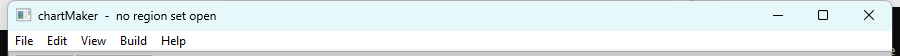
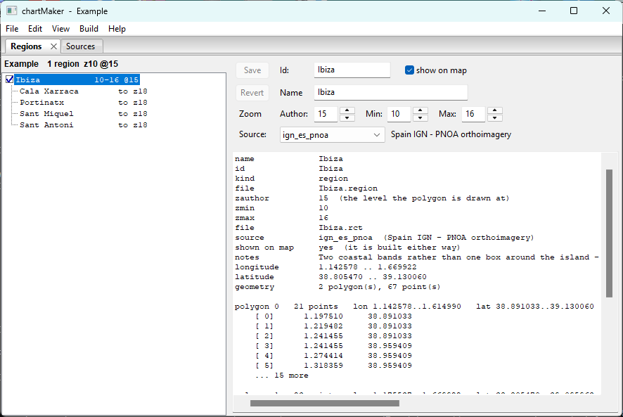

# Getting Started

**[Tutorial](readme.md)** --
**Getting Started** --
**[The Map](the_map.md)** --
**[Zoom Levels](zoom_levels.md)** --
**[Your First Region](regions.md)** --
**[Detail Areas](detail_areas.md)** --
**[Choosing a Source](choosing_a_source.md)** --
**[Building](building.md)**

folders: **[Home](../readme.md)** --
**Tutorial** --
**[Reference](../reference/readme.md)**

This chapter installs chartMaker, walks you through what a brand new installation actually
looks like, and gets you to a region set open on screen. Nothing here goes to the network
except the map imagery you look at.

**Follow along.** Everything below is in the order you would do it, and the pictures are of
the state you should be in when you reach them.

## 1. Install it

Download the installer from the
**[chartMaker Releases page](https://github.com/phorton1/base-apps-chartMaker/releases)** -
take the newest release at the top - then run it and follow the prompts. Everything
chartMaker needs is included. You do not need to install Perl, or a mapping toolkit, or
anything else first.

The first time it runs, chartMaker makes a folder for your material under your Windows
**Documents** folder:

```
    Documents\phorton1\chartMaker\
        sources\            the tile source definitions
        region_sets\        one folder per chartset you are building
        cache\              tiles it has fetched
        raster\             built .rct files
        mbtiles\            built .mbtiles charts
```

**That folder is yours.** It is what you would back up, carry to another machine, or hand to
another mariner, and uninstalling chartMaker does not touch it. Every one of those locations
can be moved - see [Preferences and Keys](../reference/preferences_keys.md).

## 2. What you see the first time you run it

**Start chartMaker.** A single window opens, and it is emptier than you might expect. Read
the **title bar** across the top of that window:

<a href="../images/no_set_open.png" target="_blank"></a>

**That is not an error and nothing has gone wrong.** chartMaker edits a *document*, the way a
word processor does, and its document is a **region set** - the description of a chartset you
are building. On a brand new installation you have not opened one, so there is not one, and
the title bar says so rather than leaving you to wonder.

The title bar is worth getting into the habit of reading. From here on it always names the
set you have open, and puts an asterisk after it when you have changes you have not saved.

**Because there is no document, most of the program is politely switched off.** Open the
menus and look:

- **`File`** - Save, Revert and Close Set are greyed. There is nothing to save, revert or
  close.
- **`Build`** - Fetch and both Builds are greyed. There is nothing to build.
- **`View`** and **`Help`** are fully live, because nothing on them needs a document.

That is the whole of what "nothing open" means. It is also exactly what you get later on
after `File - Close Set`, so it is worth recognising now rather than being surprised by it
then.

### The two windows

chartMaker is **two windows working as one program**:

- the **application window** you are looking at - the lists, the names and the numbers
- a **map**, which opens in your web browser - everything that has a position

They are one program and stay in step: select something in one and it selects in the other.
Neither is a preview of the other.

**Open the map now: `View - Map`.** Your browser opens a new tab and, after a moment,
satellite imagery of the world appears. Pan it around with the mouse and zoom with the wheel.

Notice that this works perfectly well with no region set open. You can look at imagery all
day without one. What you cannot do yet is *make* anything, because there is nowhere to put
it - and that is the next thing to fix.

Leave the map tab open. You will be going back and forth between it and the application
window for the rest of this tutorial, and having both visible at once is how the work is
actually done.

### Panes

The application window holds **panes** - the Sources pane, the Regions pane, and later the
Probe pane. They dock, they can be torn off into their own window, and they can be closed;
where you leave them is where they are next time.

Two of them you open yourself from the **`View`** menu. The **Regions** pane is different: it
appears when you open a region set and goes away when you close one, because it is the *view
of that document* rather than a window you show and hide on its own. That is why it is not in
the View menu, and why it is not there now.

## 3. Where the imagery comes from

The map you just opened is showing you *somebody's* satellite imagery. Whose, and what else
is available, is the next thing to know - because it is the one decision chartMaker cannot
make for you.

**Open `View - Sources`.** A pane appears listing what chartMaker calls **sources**. A source
is not imagery: it is a small text file - a **TSD**, a Tile Source Definition - describing one
imagery service, where its tiles live, how deep it will answer, who must be credited, and what
its publisher permits. chartMaker ships **no tiles at all**, ever. It ships four of these
descriptions.

Click each one and read the panel on the right. The radio button beside a source is how you
choose which one the map **shows**; the pane says *shown on the map* under whichever that is.
Try switching between them and watching the map tab change.

Four ship, and they divide into two pairs:

| Source | May be used for |
| ------ | --------------- |
| **Spain IGN - PNOA orthoimagery** | display **and build** |
| **IGN France - ORTHOIMAGERY.ORTHOPHOTOS** | display **and build** |
| **Esri - ArcGIS World Imagery** | display only |
| **Google - satellite imagery** | display only |

That **display only** is not a limitation chartMaker invented. It is what those operators'
published terms permit, written into the file where you can read it - Esri's item page says
its World Imagery layer is not intended for exporting tiles offline, and Google's terms
prohibit bulk downloading and caching for offline use outright. Both are superb to *look* at
while you decide where a region goes, and a display-only source simply never appears in the
build picker. Changing that word is something you may do and are answerable for.

The two that build are national orthophoto programmes published under open licences with
attribution and no key required.

**Now switch the map to Spain IGN and pan somewhere outside Spain.** The imagery stops.
That is the single most important thing on this page: **each of those two covers its own
country and nothing else.** There is no one service that covers the world at the depth a
chartset wants, so choosing a source per region is the normal case and not an advanced one.
Switch back to Esri and the world comes back.

**This tutorial works in Spanish water**, so Spain IGN is what it uses. That is a property of
the ground the example covers, not a preference of the program and not a recommendation.
Over your own water you will be choosing among quite different services, and the
[catalog](../reference/catalog.md) - `Edit - Tile Source Catalog`, or the **Catalog** button
on this pane - is where you start looking. Adding one is
[Sources and TSD Files](../reference/sources_tsd.md).

### Two different jobs, and one is not the other

There are two entirely separate questions about imagery, and confusing them is the commonest
early mistake:

| | |
| --- | --- |
| **which source you are LOOKING at** | one at a time, chosen in the Sources pane, changes nothing about your set |
| **which source a region is BUILT from** | a field on each region, chosen by you, and what actually ends up on the boat |

You can browse Esri's beautiful global imagery while building from Spain IGN, and often
should. Nothing about looking at a source implies anything about building from one - the
program deliberately never assumes the second from the first, and a region you create names
**no source at all** until you say.

[The Map](the_map.md) covers the first. [Your First Region](regions.md) covers the second.

## 4. Open a region set

Now give it a document to work on. Choose **`File - Open Set`** and pick **Example**.

Three things happen at once, and they are worth watching for:

- the **title bar** changes to `chartMaker - Example`
- the **Regions** pane appears, with a tree on the left and a properties panel on the right
- everything that was greyed a moment ago - Save, Close Set, Fetch, both Builds - comes to
  life

**Click `Ibiza` in the tree.** This is what you should be looking at:

<a href="../images/first_run.png" target="_blank"></a>

The tree on the left is the set. The panel on the right is whatever is selected in it: the
editable fields along the top, and below them a read-only dump of everything else chartMaker
knows about that object. Nothing here has been explained yet - that is the next three
chapters - but you can already see the shape of it: a name, an id, three zoom numbers, and a
**source**.

The other item beside Open Set is **`File - New Set`**, which makes an empty one and opens
it. That is what you will use for your own water; **Example** is what this tutorial works in,
so that nothing you do here touches ground you care about.

A **region set is a folder** - the files in it *are* the set, and there is no index or project
file. This one holds a single region:

```
    Example
        Ibiza           z10-16 at 15      4,316 tiles
            Xarraca     z17-18            Cala Xarraca
            Portinat    z17-18            Portinatx
            SantMiquel  z17-18            Port de Sant Miquel
            SantAntoni  z17-18            Sant Antoni
```

**Ibiza** is the region: an outline following the whole coastline of the island, carried from
an overview at zoom 10 down to zoom 16. The four **detail areas** inside it are carried two
levels deeper still, because those are the bays you actually anchor in. All of that is the
subject of the next three chapters.

It is called *Example* rather than *Ibiza* or *Spain* on purpose. It is the set that ships,
it comes back if you break it, and naming it for its ground would put it in the way of a set
you might genuinely want to call Spain one day.

**Click one of the four indented entries and watch the panel change.** Fewer fields, and
different ones. That is a *detail area* rather than a region, and the difference is the
subject of [Detail Areas](detail_areas.md).

**And this is why the example set exists.** Not because Ibiza is where you should build, or
Spain IGN the service you should use, but because one small real set contains every idea
you need: a region, an outline, three zoom numbers, a chosen source, and detail areas going
deeper where it matters. Learn it here on ground that costs you nothing to break, and the
set you actually want - your own coast, your own service - is the same five ideas with
different values.

Nothing you do in it changes a file until you save.

## 5. It is yours to break

Open things. Change numbers. Delete the region and see what the pane says. You cannot lose
anything that matters, because:

- Nothing reaches your disk until **`File - Save`**.
- Closing the set without saving throws the whole session away.
- And if you ever want the shipped material back exactly as it came - the four sources, the
  example set, or all of it - **`Help - Restore Shipped Sources and Examples`** puts it back.

That last one is worth knowing now rather than later. It shows you what ships, what is on
your disk, and what differs; a file that is simply missing is ticked, and a file **you have
changed** is listed but *not* ticked, so nothing you edited is replaced unless you say so. A
region you drew yourself is never in that list at all.

Two more items sit beside it in the same menu: **`Help - User Manual`** opens this manual, and
**`Help - About chartMaker`** tells you which version you are running.

---

**Next:** [The Map](the_map.md)
