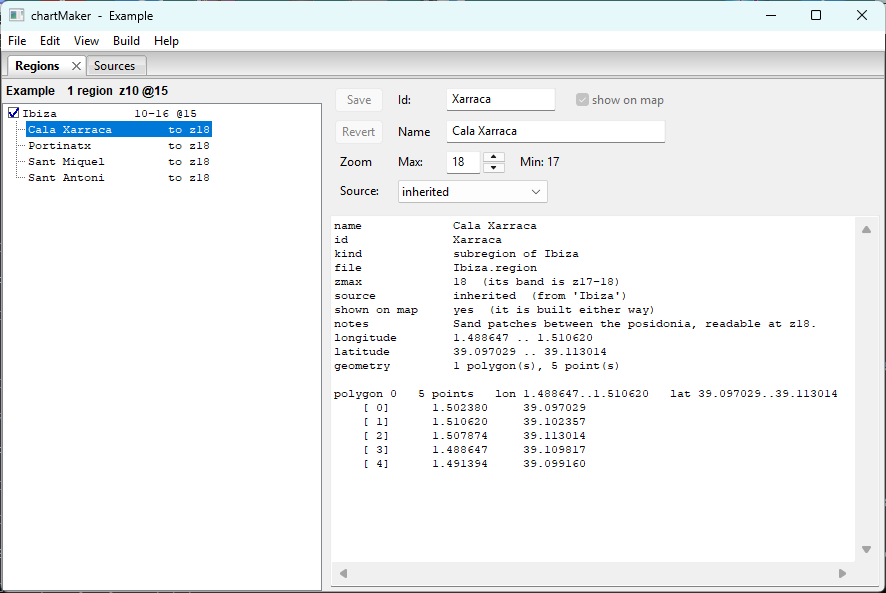

# Getting Started

**[Tutorial](readme.md)** --
**Getting Started** --
**[The Map](the_map.md)** --
**[Your First Region](regions.md)** --
**[Detail Areas](detail_areas.md)** --
**[Choosing a Source](choosing_a_source.md)** --
**[Building](building.md)**

folders: **[Home](../readme.md)** --
**Tutorial** --
**[Reference](../reference/readme.md)**

This chapter installs chartMaker, shows you the two windows it runs in, and opens the example
region set. Nothing here goes to the network except the map imagery you look at.

## 1. Install it

Download the installer from the
**[chartMaker Releases page](https://github.com/phorton1/base-apps-chartMaker/releases)** -
take the newest release at the top - then run it and follow the prompts. Everything
chartMaker needs is included. You do not need to install Perl, or a mapping toolkit, or
anything else first.

The first time it runs, chartMaker makes a folder for your material under your Windows
**Documents** folder:

```
    Documents\phorton1\chartMaker\
        sources\            the tile source definitions
        region_sets\        one folder per chartset you are building
        cache\              tiles it has fetched
        raster\             built .rct files
        mbtiles\            built .mbtiles charts
```

**That folder is yours.** It is what you would back up, carry to another machine, or hand to
another mariner, and uninstalling chartMaker does not touch it. Every one of those locations
can be moved - see [Preferences and Keys](../reference/preferences_keys.md).

## 2. First run

<a href="../images/first_run.png" target="_blank"></a>

chartMaker is **two windows working as one program**: a native application window, and a map
that opens in your web browser. The application holds the lists, the names and the numbers.
The map holds everything that has a position.

In the application window:

- **`View - Sources`** opens the **Sources** pane: the tile source definitions you have.
- **`View - Map`** opens the map in your browser.
- The **Regions** pane appears when you open a region set, because it is the *view* of that
  set rather than a window you show and hide on its own.

Panes dock, tear off, and can be closed; where you leave them is where they are next time.

## 3. The sources that come with it

Open **`View - Sources`** and you will find four definitions already there. They are ordinary
editable text files in your `sources` folder, and they divide into two pairs:

| Source | May be used for |
| ------ | --------------- |
| **Spain IGN - PNOA orthoimagery** | display **and build** |
| **IGN France - ORTHOIMAGERY.ORTHOPHOTOS** | display **and build** |
| **Esri - ArcGIS World Imagery** | display only |
| **Google - satellite imagery** | display only |

That **display only** is not a limitation chartMaker invented. It is what those operators'
published terms permit, written into the file where you can read it - Esri's item page says
its World Imagery layer is not intended for exporting tiles offline, and Google's terms
prohibit bulk downloading and caching for offline use outright. Both are superb to *look* at
while you decide where a region goes, and a display-only source simply never appears in the
build picker. Changing that word is something you may do and are answerable for.

The two that build are national orthophoto programmes published under open licences with
attribution and no key required. **Spain IGN** is the default, it reaches real detail to
about z18 over its own ground, and it is what this tutorial uses throughout.

## 4. Open the example set

Choose **`File - Open Set`** and pick **Example**.

<a href="../images/tree.png" target="_blank"></a>

A **region set is a folder** - the files in it *are* the set, and there is no index or project
file. This one holds a single region:

```
    Example
        Ibiza           z10-16 at 15      4,316 tiles
            Xarraca     z17-18            Cala Xarraca
            Portinat    z17-18            Portinatx
            SantMiquel  z17-18            Port de Sant Miquel
            SantAntoni  z17-18            Sant Antoni
```

**Ibiza** is the region: an outline following the whole coastline of the island, carried from
an overview at zoom 10 down to zoom 16. The four **detail areas** inside it are carried two
levels deeper still, because those are the bays you actually anchor in. All of that is the
subject of the next three chapters.

It is called *Example* rather than *Ibiza* or *Spain* on purpose. It is the set that ships,
it comes back if you break it, and naming it for its ground would put it in the way of a set
you might genuinely want to call Spain one day.

Click **Ibiza** and look at the panel on the right; click one of the detail areas and watch
the numbers change. Nothing you do here changes a file until you save.

## 5. It is yours to break

Open things. Change numbers. Delete the region and see what the pane says. You cannot lose
anything that matters, because:

- Nothing reaches your disk until **`File - Save`**.
- Closing the set without saving throws the whole session away.
- And if you ever want the shipped material back exactly as it came - the four sources, the
  example set, or all of it - **`Help - Regenerate Examples`** puts it back.

That last one is worth knowing now rather than later. It shows you what ships, what is on
your disk, and what differs; a file that is simply missing is ticked, and a file **you have
changed** is listed but *not* ticked, so nothing you edited is replaced unless you say so. A
region you drew yourself is never in that list at all.

Two more items sit beside it in the same menu: **`Help - User Manual`** opens this manual, and
**`Help - About chartMaker`** tells you which version you are running.

---

**Next:** [The Map](the_map.md)
