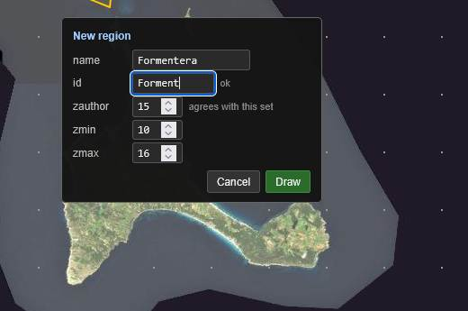
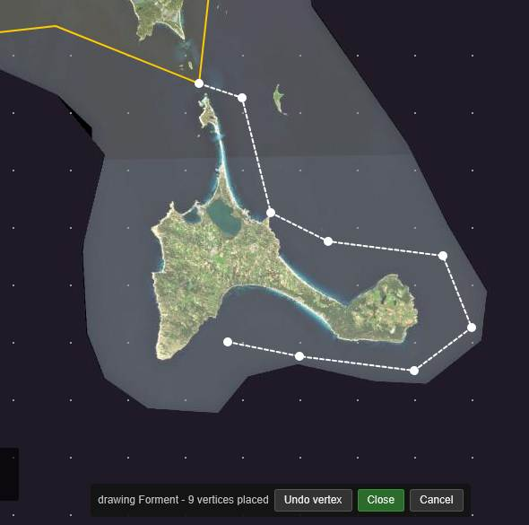

# Your First Region

**[Tutorial](readme.md)** --
**[Getting Started](getting_started.md)** --
**[The Map](the_map.md)** --
**Your First Region** --
**[Detail Areas](detail_areas.md)** --
**[Choosing a Source](choosing_a_source.md)** --
**[Building](building.md)**

folders: **[Home](../readme.md)** --
**Tutorial** --
**[Reference](../reference/readme.md)**

Formentera lies four miles south of Ibiza, across a strait called **Es Freus**. The example
set does not include it. You are going to draw it.

## What a region is

A **region** is an area of water you care about, described by an outline, together with a
statement of how much detail it deserves. That is all it is. It holds its own geometry, its
own name, and the detail areas nested inside it, and it refers to nothing outside itself - no
parent elsewhere, no path on your disk. That is what makes a region file the thing you can
hand to another mariner: it is a complete description of a piece of coastline and nothing
else.

**One region is one file**, and a **set is a folder of them**. There is no project file.

## The three numbers

Before you draw anything, the three zoom numbers, because they decide everything downstream.
Web Mercator zoom levels are the same ones every online map uses: each level doubles the
resolution and quadruples the number of tiles.

| | |
| --- | --- |
| **`zauthor`** | The level your outline is cut at. This is the one that is not obvious - see below. |
| **`zmin`** | The coarsest level the region carries: the overview you see when zoomed right out. |
| **`zmax`** | The finest level the region itself carries. |

The example region uses **15 / 10 / 16**, and those are good numbers to copy.

**`zauthor` is where your polygon meets the tile grid.** Your outline is a smooth line on the
earth; a chartset is made of square tiles. Exactly once, at this level, the outline is turned
into a set of tiles - and everything else follows from that set. Coarser levels are those
tiles' parents; finer levels fill them in completely. **z15 is the right answer** for coastal
work: a z15 tile is roughly a kilometre, which follows a coastline closely enough without
producing a staircase of thousands of tiles.

**Two of the three belong to the whole set, not to one region.** Every region built onto one
E-Series card has to agree on `zauthor` and `zmin`, because the plotter fuses them into a
single pyramid. Only `zmax` varies freely. The Regions pane shows all three in a column so a
disagreement is visible, and it says outright above the tree whether your set agrees or is
**mixed**.

**`zmax` is a request, not a promise.** It says what this water *deserves*. A build can cap
below it, and the imagery may not really go that deep - chapter five is about finding out
which.

## Draw Formentera

Pan the map south until Formentera and the strait are on screen.

**1. Right-click on open water** near the island. The only thing offered is **Create
Region**. A small panel opens where you clicked.

**2. Fill it in.**

- **Name** - `Formentera`. Free text, change it whenever you like.
- **Id** - `Forment`. This one carries load: it is the file name, the key the set refers to,
  and the stem of the exported file. Letters and digits only, and **at most eight characters
  for a region**, because that stem becomes an old-style 8.3 short name on an E-Series card.
  chartMaker suggests an id from the name and expects you to shorten it, and tells you at once
  if it collides with something already in the set.

  The eight is a convention worth keeping rather than a law of the format - long file names do
  work on a card - but the `.RCT` exporter holds you to it today, so a longer region id builds
  to MBTiles and is refused for RCT. **Detail areas are not constrained at all**: they never
  appear in an `.RCT`, so name them whatever reads best.
- **zauthor 15, zmin 10, zmax 16** - matching Ibiza, and the panel confirms as you type that
  these agree with the regions already there.

**3. Press Draw.** The panel closes, a bar appears along the bottom of the map, and you are
drawing.

**4. Click your way around the island.** Each click places a vertex and the bar counts them.
There is no need for care or for many points - a dozen is plenty, and a rough box would do.
The bar carries **Undo vertex** if you misplace one.

**5. Close the ring** - the **Close** button, or a double-click, or Enter. Three vertices is
the minimum.

**Closing does not save.** The finished outline goes straight into the editing bar with its
handles live, so the vertex you fumbled is still fixable.

## Adjusting the outline

The editing bar names what is under your hand and offers three gestures:

- **drag a vertex** to move it
- **drag a midpoint** - the small hollow handles - to insert a new vertex there
- **right-click a vertex** to delete it

**Nothing moves the whole polygon.** A press anywhere except on a handle pans the map, which
is what you want constantly: a region is bigger than a screenful and reaching its far side is
the commonest thing you do mid-edit.

**Confirm** commits the outline. **Cancel** puts back what was there before.

Abandoning a drawing costs only the drawing. If you created the region moments ago it stays
in the tree, named and empty, and the map offers to draw it again - which is exactly why
creating and drawing are two steps.

## The Regions pane

Switch to the application window. Formentera is in the tree, alongside Ibiza, with its zoom
columns beside it.

The pane is the tree on the left and the properties of whatever is selected on the right:
the editable fields at the top, **Save** and **Revert** beside them, and a read-only dump
below showing the bounds, the polygon and vertex counts, and the detail areas. That dump is
there to answer "did that do what I think it did" without going back to the map.

Two things on this pane are worth knowing now:

- The **checkbox** beside a region means *show it on the map*, and nothing more. It is not
  membership - the set is the folder, so every region in it gets built whether or not you are
  currently looking at it. Unchecking one is how you get it out of your way.
- A region with **no geometry says so**, right in the row. That is a normal state, and it is
  exactly what the tree is for, because an outline-less region is invisible on the map.

## Two Saves, and they are not the same Save

This trips up everybody once, so learn it here:

| | |
| --- | --- |
| **Save in the properties panel**, or in the map's editing bar | takes your half-typed changes into the **document** |
| **`File - Save`** | writes the **document** to the folder on disk |

The first is about one object and happens constantly. The second is about the whole set and
happens when you decide it should. Typing in the properties fields changes nothing until you
press the first one; **Revert** throws those edits away and goes back to what is on disk.

**Nothing reaches your disk until `File - Save`.** Three good things follow. Killing the
program loses only what you had not saved. A session of experiments is thrown away by closing
the set without saving. And while an object has unsaved changes, chartMaker refuses to select
something else or to start a build - it names the object and points at Save and Revert,
because a chartset built from the disk while your screen shows something else is a
discrepancy you would only discover on the water.

**Save now** - `File - Save` - and look in
`Documents\phorton1\chartMaker\region_sets\Example\`. There is a new file, `Forment.region`.
That is the whole of what you made: one file, self-contained, and something you could email
to somebody in Formentera tomorrow.

---

**Next:** [Detail Areas](detail_areas.md)
