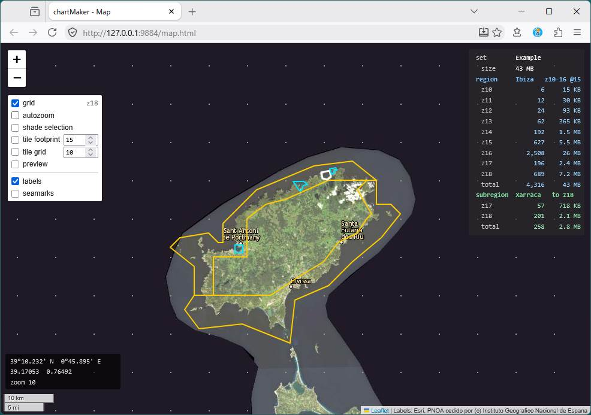

# The Map

**[Tutorial](readme.md)** --
**[Getting Started](getting_started.md)** --
**The Map** --
**[Zoom Levels](zoom_levels.md)** --
**[Your First Region](regions.md)** --
**[Detail Areas](detail_areas.md)** --
**[Choosing a Source](choosing_a_source.md)** --
**[Building](building.md)**

folders: **[Home](../readme.md)** --
**Tutorial** --
**[Reference](../reference/readme.md)**

You opened the map in the last chapter and left it running. Go back to that browser tab now -
with the **Example** set open it has changed, and this chapter is about everything on it.

**Find Ibiza.** In the application window, click **Ibiza** in the Regions tree, then switch to
the map tab. If it is not on screen, tick **`autozoom`** in the palette down the left and
click Ibiza again - the map will fly to it. (That switch is explained below; use it now and
read about it in a minute.)

You should be looking at the island with a **yellow outline** around it - that is the region -
and four small **cyan** shapes on its north coast, which are its detail areas.

The map and the application are one program. Select something here and it selects in the
Regions pane; select it there and it selects here. Neither is the fallback for the other.

## Getting about

If you have used any online map you already know all of this, and if you have not, it is
thirty seconds:

| | |
| --- | --- |
| **drag** | pan - press anywhere that is not a handle and move |
| **wheel** | zoom in and out at the pointer |
| **double-click** | zoom in one level |
| **+ / -** buttons, top left | zoom in and out one level |
| **left-click** | select the innermost object under the pointer; on open water, deselect |
| **right-click** | the menu for whatever is under the pointer - this is where everything happens |

**It is an ordinary browser tab.** Nothing stops you bookmarking it, opening it on a second
monitor, or having it open beside the application window - which is how most of the work
actually gets done, since the map holds the shapes and the application window holds the
numbers. Closing the tab does not close chartMaker; `View - Map` opens it again, back where
you were looking.

**Where you were looking is remembered by the browser**, not by chartMaker, so it survives
closing the tab and reopening it. The first time ever, with nothing to remember, it opens on
your regions - and with no set open, on the world.

**Do not use the browser's Back button** to undo something you did on the map. Nothing on the
map is a page navigation; Back simply leaves. Every edit has its own Cancel on screen.

## Where the imagery comes from

The imagery you are looking at is fetched by the **application**, not by your browser - which
is why a source needing a password still works and your browser never sees the password.

### The source you are looking at

You met this in the last chapter: the **view source** is whichever one has the radio button
beside it in the Sources pane, exactly one is in force, and switching it is instant.

Two things to add now that a set is open.

**It decides nothing about your chartset.** It is not a default, it is not a fallback, and no
region ever acquires it by accident. What a region is built from is a field on that region
that you set yourself - see [Your First Region](regions.md#tell-it-where-the-pixels-come-from).
Getting those two confused is the commonest early mistake there is, which is why the program
keeps them so far apart: one lives on the map, the other lives on the region. A display-only
source is a perfectly good view source; several of the best ones are.

**Switching it is how you judge a service.** Look at Esri to find a bay, switch to the one you
intend to build from to see whether its imagery is any good *there*, switch back. That is the
normal working rhythm, and it is what stops you discovering after an hour of fetching that
your chosen service is soft over the one anchorage you cared about.

The last two rows of the palette - **labels** and **seamarks** - draw somebody else's map
over the imagery. They are there to help you find your way about. Nothing builds them, and
nothing you export will contain them.

### A tile that is not there says so

Sooner or later you will pan somewhere a service has nothing, and you will get a plain grey
square with chartMaker's name on it. **That is the program telling you the imagery ran out,
not the program failing.** Every service says "nothing here" differently - some refuse
politely, some send back a blank picture and call it a success - and chartMaker resolves all
of them into this one square so that it means exactly one thing.

If a tile simply fails to arrive - a dropped connection, a server hiccup - nothing is drawn
at all and the next pan asks again. That is deliberate: a failure is not an absence, and
painting it like one would be a lie you could not clear.

## The palette

Down the left, under the zoom buttons, is a stack of rows. Each is a switch and, on some
rows, a number. They are the whole of the map's furniture; everything that *changes*
something is a right-click instead.

**Two things in that picture are worth naming before the list.**

The sea around the island is flat and featureless because the map is being shown on **Spain
IGN**, whose imagery stops at the Spanish coastal strip - it is the same coverage edge you
found in the last chapter by panning off Spain, seen from above. Switch the view source to
Esri and the sea fills in. Neither is more correct; they are different services.

The panel top right nests: the **set**, then the selected **region**, then a selected
**detail area** below it. Yours will show fewer blocks until you have selected something at
each level.

**`grid`** - draws small grey dots at tile-grid intersections and makes vertices land on
them. The number beside it is the level being snapped to. This is [Detail Areas](detail_areas.md).

**`autozoom`** - when the selection changes from somewhere *else* - the Regions pane, say -
the map flies to that object. It deliberately does not fire when you click something on the
map, because moving the ground out from under the click that chose it is maddening.

**`shade selection`** - washes the selected object with colour. Handy for finding it, and the
first thing to switch off when you are judging the ground *under* a vertex.

**`tile footprint`** - draws the actual tiles a level is made of, as rectangles on the water,
with a count. The spinner picks the level. This is how "how much am I asking for" stops being
an abstraction.

**`tile grid`** - draws where a level's tile edges fall across the whole view, whether or not
anybody has drawn a region there. Useful for reading a coverage boundary or planning where a
region should stop.

**`preview`** - switches the map from *what this service holds* to *what my chartset will
actually contain*. See [Choosing a Source](choosing_a_source.md).

## The info panel

Top right, and nothing on it is clickable - it answers rather than does. It nests the way
your set does:

- the **set** on the top line, with what the whole build would cost
- the **selected region**, level by level, with a tile count and a size against each - and
  its totals include everything inside it
- the **selected detail area** below that, carrying only the band it adds

The blocks do not overlap, so they read down the panel as addition. Select **Ibiza** now and
read it: **4,316 tiles** all told, most of them at z16.

The panel does not follow your hand. Drag a vertex around and it sits still, updating when
the edit is committed - recomputing coverage under a moving mouse would cost far more than it
could tell you.

## Right-click is the whole of the interface

Everything that changes something starts with a right-click **on the thing you mean**.

- Over **open water**: *Create Region*, and nothing else.
- Over a **region or detail area**: the menu names the object at the top - so you can see
  whether you got the one you meant - and then offers editing its polygon, adding a polygon,
  adding a detail area, its properties, deleting, and **Probe**.

The target is whatever filled shape is under the pointer, innermost first, so a detail area
wins over the region containing it. Right-click the same spot again and it steps outward,
which is how you reach a region that its own detail area is sitting on top of.

The menus over a region and over a detail area are identical, because they are the same kind
of thing at different depths. Detail areas nest as deep as you like and so does that menu.

## Left-click selects

A click selects the innermost thing under it; a click on open water clears the selection.
Selecting costs nothing and commits nothing. The selected object draws **white**, over the
yellow of a region and the cyan of a detail area - what *kind* of thing it is you can read
off the tree, but which one is under discussion you cannot read anywhere else.

---

**Next:** [Zoom Levels](zoom_levels.md)
